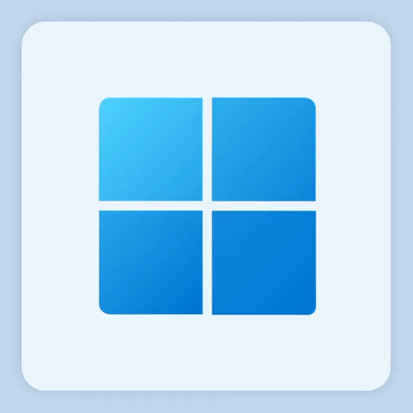

<h1 align="center">
  
</h1>

  
  

<h2 align="center">Android Developer!</h2>

 

🌱 I’m currently learning Android Development and Artificial Intelligence 
👨🏻‍💻 Introvert (INTJ-T) 
📫 How to reach me <a href="mailto:faldiansyahk@gmail.com">Email</a>

## Equipment ⚒️
<table>
    <tr align="center">
        <td>Operating System</td>
        <td>
            
          MacOS
        </td>
        <td>
            
          Windows
        </td>
        <td>
            
          Linux
        </td>
    </tr>
    <tr align="center">
        <td>Text Editor</td>
        <td>
            
          Visual Studio
        </td>
        <td>
            
          Sublime Text
        </td>
        <td>
            
          Android Studio
        </td>
    </tr>
</table>

## Tech Stack 💻

## Deployment & Tools

## Stats 🚀

    

 

